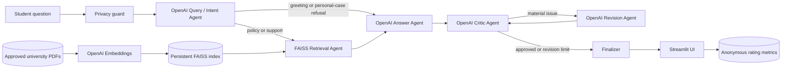

# Architecture

## Shared LangGraph state

The state carries the question, recent browser-session chat history, classified intent, retrieved FAISS chunks, grounded context, draft, critique, revision count, final answer, and page-level citation metadata. Conditional edges skip retrieval for greetings and privacy/personal-case refusals and control the critic/revision loop.

## Technology decision

The original proposal named Llama 3 as a possible open model. This implementation deliberately uses OpenAI models as the query, answer, critic and revision agents. FAISS is the persistent vector database, while OpenAI's embedding model creates document and query vectors.
